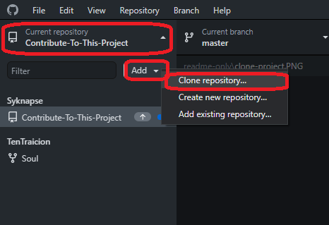
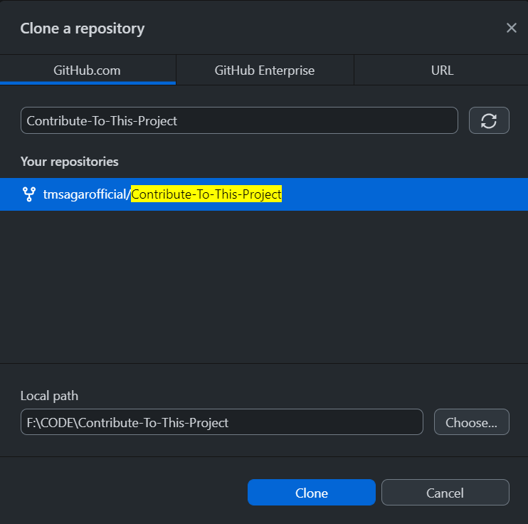

# [এই প্রকল্পে অবদান রাখুন](https://syknapse.github.io/Contribute-To-This-Project/)

> ## **ঘোষণা:**
>
> আপনি কি আমাদের প্রকল্পে যুক্ত হয়ে আমাদের প্রকল্পটি পরিচালনা করতে এবং এটি বহাল রাখতে ইচ্ছুক?, তবে আমাদের [পরিচালনা নির্দেশাবলি](../maintainer_guide/maintainer_guide_bangla.md) পরুন এবং আমাকে [টুইটারে](https://twitter.com/Syknapse) একটি বার্তা প্রেরণ করুন।

## সূচনা

এটি গিটহাবে নতুনদের সহজ প্রকল্পে অংশগ্রহণ করতে সহায়তা করার জন্য একটি পথ প্রদর্শক।

## উদ্দেশ্য

- একটি ওপেন সোর্স প্রজেক্টে অবদান রাখা।
- গিটহাব ব্যাবহারকে আরও সহজ করে তোলা।

## এটি কার জন্য?

- এটি একদম নতুনদের জন্য। আপনি যদি একটি অ্যাঙ্কর ট্যাগ `` লিখতে এবং সম্পাদনা করতে জানেন, তবে আপনি এখানে অবদান রাখতে সক্ষম।
- অভিজ্ঞরাও এখানে অবদান রাখতে পারেন কিন্তু যারা তাদের প্রথম ওপেন সোর্স এ অবদান রাখতে চান এবং নিজের অভিজ্ঞতা ও আত্মবিশ্বাস বারাতে চান এই প্রকল্পটি তাদের জন্যও।

## আমাকে এটি কেন করতে হবে?

যেকোনো ওয়েব ডেভেলপার কে গিট সম্পর্কে দক্ষতা অর্জন করতে হবে, এবং গিটহাব হল সবার দ্বারা ব্যবহৃত সবচেয়ে জনপ্রিয় গিট হোস্টিং পরিষেবা। এটি ওপেন সোর্স প্লাটফর্মের শিকড়। গিটহাব ব্যবেহার করতে জানা একটি অপরিহার্য দক্ষতা। তাছাড়াও গিটহাবে একটি প্রকল্পে অবদান রাখলে তা আত্মবিশ্বাস বাড়াতে সহায়তা করে থাকে।

আপনি যদি একজন নতুন ডেভেলপার হন এবং আপনি যদি ভেবে থাকেন যে আপনার গিট এবং গিটহাব শিখতে হবে তবে এখানে উত্তরটি রয়েছেঃ [আপনার গতকাল গিট শেখা উচিত ছিল](https://codeburst.io/number-one-piece-of-advice-for-new-developers-ddd08abc8bfa 'নতুন ডেভেলপার? আপনার গতকাল গিট শেখা উচিত ছিল। Brandon Morelli, CodeBurst.io-এর প্রতিষ্ঠাতা').

## আমি এখানে কি করতে যাচ্ছি?

আপনি এই ছবির মত করে [আমাদের প্রকল্পের ওয়েবসাইটে](https://syknapse.github.io/Contribute-To-This-Project/ 'https://syknapse.github.io/Contribute-To-This-Project')আপনার সম্পর্কিত একটি কার্ড যোগ করতে চলেছেন। এতে আপনার নাম, আপনার টুইটার প্রোফাইল, একটি সংক্ষিপ্ত বিবরণ এবং আপনি সুপারিশ করা ওয়েব ডেভেলপারদের জন্য দরকারী সংস্থানগুলির ৩টি লিঙ্ক অন্তর্ভুক্ত করবেন।

আপনি HTML ফাইলের ভিতরে কার্ড টেমপ্লেটের একটি অনুলিপি তৈরি করবেন এবং আপনার নিজস্ব তথ্য দিয়ে এটি সাজাবেন।

> ### [আপনি যদি টার্মিনালের সাথে স্বাচ্ছন্দ্যবোধ করেন তবে এই টিউটোরিয়ালটিতে যান](../../terminal-tutorial.md)

## অনুবাদ

এই টিউটোরিয়ালটি [অন্যান্য ভাষায়ও](../translation.md) পাওয়া যাবে।

| [আরবি](ARABIC.md)         | [ফরাসি](FRENCH.md)       | [জার্মান](German.md)   | [ইতালিয়ান](ITALIAN.md) | [কোরিয়ান](KOREAN.md)     | [পোলিশ](POLISH.md) |
| ------------------------- | ------------------------ | ---------------------- | ----------------------- | ------------------------- | ------------------ |
| [পর্তুগীজ](PORTUGUESE.md) | [সার্বিয়ান](SERBIAN.md) | [স্পেনীয়](SPANISH.md) | [তুর্কি](TURKISH.md)    | [ইংরেজি](../../README.md) | বাংলা              |

> আমাদের প্রকল্পের README.md ফাইলটি বা পরিচালনা নির্দেশাবলি পেজটি যেকোনো ভাষায় অনুবাদকে আমরা স্বাগত জানাই।

## সুচিপত্র

| <ul><li>[সূচনা](#সূচনা)</li><li>[আমি এখানে কি করতে যাচ্ছি?](#আমি-এখানে-কি-করতে-যাচ্ছি)</li><li>[প্রস্তুতি](#প্রস্তুতি-)</li><li>[অবদান রাখুন &rightarrow;](#অবদান-রাখুন)</li><li>[পরবর্তি ধাপসমুহ](#পরবর্তি-ধাপসমুহ)</li><li>[স্বীকৃতি](#স্বীকৃতি)</li></ul> | অবদান রাখুন: <ul><li>[ধাপ ১ঃ এই রিপোজিটরি ফর্ক করুন](#ধাপ-১ঃ-এই-রিপোজিটরি-ফর্ক-করুন)</li><li>[ধাপ ২ঃ রিপোসিটরিটি ক্লোন করুন](#ধাপ-২ঃ-রিপোসিটরিটি-ক্লোন-করুন)</li><li>[ধাপ ৩ঃ একটি নতুন শাখা তৈরি করুন](#ধাপ-৩ঃ-একটি-নতুন-শাখা-তৈরি-করুন)</li><li>[ধাপ ৪ঃ index.html ফাইলটি খুলুন](#ধাপ-৪ঃ-indexhtml-ফাইলটি-খুলুন)</li><li>[ধাপ ৫ঃ কার্ড এর টেম্পলেটটি কপি করুন](#ধাপ-৫ঃ-কার্ড-এর-টেম্পলেটটি-কপি-করুন)</li><li>[ধাপ ৬ঃ প্রয়োজনীয় পরিবর্তন করুন](#ধাপ-৬ঃ-প্রয়োজনীয়-পরিবর্তন-করুন)</li><li>[ধাপ ৭ঃ আপনার পরিবর্তনগুলি কমিট করুন](#ধাপ-৭ঃ-আপনার-পরিবর্তনগুলি-কমিট-করুন)</li><li>[ধাপ ৮ঃ পরিবর্তনগুলো গিটহাবে পুশ করুন](#ধাপ-৮ঃ-পরিবর্তনগুলো-গিটহাবে-পুশ-করুন)</li><li>[ধাপ ৯ঃ পুল রিকোয়েস্ট সাবমিট করুন](#ধাপ-৯ঃ-পুল-রিকোয়েস্ট-সাবমিট-করুন)</li><li>[ধাপ ১০ঃ আনন্দ উদযাপন করুন](#ধাপ-১০ঃ-আনন্দ-উদযাপন-করুন)</li></ul> |
| :----------------------------------------------------------------------------------------------------------------------------------------------------------------------------------------------------------------------------------------------------------- | :---------------------------------------------------------------------------------------------------------------------------------------------------------------------------------------------------------------------------------------------------------------------------------------------------------------------------------------------------------------------------------------------------------------------------------------------------------------------------------------------------------------------------------------------------------------------------------------------------------------------------------------------------------------------------------------------------------------------------------------------------------------------------------------------------------------- |

### প্রস্তুতি! :)

প্রথমে কাজটি করার জন্য প্রস্তুতি নেয়া যাক।

- আপনার GitHub অ্যাকাউন্টে লগইন করুন। যদি আপনার অ্যাকাউন্ট না থাকে তবে [অ্যাকাউন্ট খুলুন](https://github.com/join)। পরবর্তি ধাপে যাওয়ার পুর্বে [GitHub হ্যালো ওয়ার্ল্ড টিউটোরিয়াল](https://guides.github.com/activities/hello-world/) সম্পন্ন করে নিন।
- [GitHub কম্পিউটার সফটওয়্যারটি](https://desktop.github.com/) নামিয়ে নিন।
  - বিকল্পভাবে আপনি যদি কমান্ড লাইনে গিট ব্যবহার করতে স্বাচ্ছন্দ্য বোধ করেন তবে আপনি তা করতে পারেন [এখানে CLI টিউটোরিয়ালের লিঙ্ক রয়েছে](../../terminal-tutorial.md)।
  - আপনি যদি [VS Code](https://code.visualstudio.com/ 'ভিজ্যুয়াল স্টুডিও কোড ওয়েবসাইট') ব্যাবহার করে থাকেন, এটি ইন্টিগ্রেটেড গিটের সাথে আসে এবং আপনাকে সরাসরি সম্পাদক থেকে যা প্রয়োজন তা করতে দেয়।
  - তবে এই টিউটোরিয়ালটি অনুসরণ করার সবচেয়ে সহজ উপায় হল GitHub ডেস্কটপ ব্যবহার করা।

> এখন যেহেতু আপনার প্রস্তুতি গ্রহণ সম্পন্ন হয়েছে, চলুন আমরা প্রকল্পের কাজটি শুরু করি।

#### [↑ সুচিপত্র ↑](#সুচিপত্র)

## অবদান রাখুন

১০টি সহজ ধাপে একজন ওপেন সোর্স অবদানকারী হয়ে উঠুন।

_আনুমানিক সময়: ৩০ মিনিটেরও কম_।

## ধাপ ১ঃ এই রিপোজিটরি ফর্ক করুন

- এখানে উদ্দেশ্য হল এই প্রকল্পের একটি অনুলিপি তৈরি করা এবং এটি আপনার অ্যাকাউন্টে রাখা।
- একটি রিপোজিটরি (রিপো) হল গিটহাবের একটি প্রকল্পক এবং একটি ফর্ক হল প্রকল্পের একটি অনুলিপি।
- নিশ্চিত করুন যে আপনি এই রিপোর [মূল পৃষ্ঠায়](https://github.com/Syknapse/Contribute-To-This-Project 'https://github.com/Syknapse/Contribute-To-This-Project') আছেন।

| <ul><li>এই পৃষ্ঠার উপরের অংশে _ফর্ক (fork)_ বাটনে ক্লিক করুন।</li></ul> |  |
| :---------------------------------------------------------------------- | ---------------------------------------------------------: |

- এখন আপনার নিজের অ্যাকাউন্টে এই প্রকল্পের একটি সম্পূর্ণ অনুলিপি আছে।

  [↑ সুচিপত্র ↑](#সুচিপত্র)

---

## ধাপ ২ঃ রিপোসিটরিটি ক্লোন করুন

- এখন আমরা এই প্রকল্পের একটি স্থানীয় অনুলিপি করতে চাই। এটি আপনার নিজের কম্পিউটারে সংরক্ষিত একটি অনুলিপি।
- GitHub কম্পিউটার সফটওয়্যারটি খুলুন। অ্যাপে:

| <ul><li>প্রথমে _File_ মেনুতে এবং পরে _Clone repository_ -তে ক্লিক করুন।</li></ul> |  |
| :-------------------------------------------------------------------------------- | ------------------------------------------------------------------------: |

| <ul><li>আপনি গিটহাবে আপনার প্রকল্প এবং ফর্কগুলির একটি তালিকা দেখতে পাবেন।</li><li>`<আপনার গিটহাব ইউজারনেইম>/Contribute-To-This-Project` নির্বাচন করুন।</li><li>_Clone_ -এ ক্লিক করুন।</li></ul> |  |
| :---------------------------------------------------------------------------------------------------------------------------------------------------------------------------------------------- | :-------------------------------------------------------------------------------------------------------------------------: |
| <ul><li>একটি ফর্ক করা প্রকল্পের বাম দিকে ফর্কের প্রতীক থাকবে।</li><li>আপনার ফর্কে আপনার নিজস্ব GitHub ইউজারনেইম নাম থাকবে।</li></ul>                                                            |                        |

- প্রকল্পটি আপনার হার্ড ডিস্কে অনুলিপি হতে কিছু সময় লাগবে। ক্লোন করার সময় ডিরেক্টরি পরিবর্তন না করাই উত্তম। যা সাধারণত `..\Documents\GitHub` হয়ে থাকে।
- এখন আপনার কম্পিউটারে প্রকল্পের একটি অনুলিপি রয়েছে।

  [↑ সুচিপত্র ↑](#সুচিপত্র)

---

## ধাপ ৩ঃ একটি নতুন শাখা তৈরি করুন

- একবার রিপোটি ক্লোন হয়ে গেলে এটি স্বয়ংক্রিয়ভাবে আপনার GitHub ডেস্কটপে খুলে যাবে। এখন একটি নতুন শাখা তৈরি করার সময়।
- `মাস্টার(master)`নামক প্রকল্পের মূল অংশ থেকে আপনার পরিবর্তনগুলিকে আলাদা রাখার একটি উপায় হল শাখা বা ব্রাঞ্চ (branch)। উদাহরণস্বরূপ, যদি কিছু ভুল হয়ে যায় এবং আপনি আপনার পরিবর্তনের সাথে খুশি না হন তবে আপনি কেবল শাখাটি বা ব্রাঞ্চটি মুছে ফেলতে পারেন এবং সেখানে মূল প্রকল্প প্রভাবিত হবে না।

| <ul><li>_Current branch_ -এ ক্লিক করুন।</li><li>এরপর _New_ -এ ক্লিক করুন।</li></ul> |  |
| :---------------------------------------------------------------------------------- | -----------------------------------------------------------------------------------------------------: |

| <ul><li>শাখাটিকে একটি নাম প্রদান করুন।</li><li>`Create branch` -এ ক্লিক করুন।</li></ul> |  |
| :-------------------------------------------------------------------------------------- | ------------------------------------------------------------------------: |

- আপনি এই শাখাটিকে যা খুশি নাম দিতে পারেন, কিন্তু যেহেতু এটি প্রকল্পে আপনার নামের সাথে একটি কার্ড যোগ করার একটি শাখা, তাই এটিকে `আপনার নাম-কার্ড` বলা ভাল অনুশীলন কারণ, এটি এই শাখার উদ্দেশ্য পরিষ্কার রাখে।

| <ul><li>GitHub-এ আপনার নতুন শাখা ঘোষণা করুন।</li></ul> |  |
| :----------------------------------------------------- | ------------------------------------------------------------------------------------------------------------------------------------: |

- এখন আপনি `মাস্টার(master)` থেকে আলাদা একটি নতুন শাখা তৈরি করেছেন।
- পরবর্তী পদক্ষেপের জন্য নিশ্চিত করুন যে আপনি এই শাখায় কাজ করছেন। আপনি GitHub ডেস্কটপ অ্যাপের সবার উপরে _Current Branch_ এর নিচে যে শাখায় আছেন তার নামটি দেখতে পাবেন।

**`মাস্টার(master)` শাখায় কাজ করবেন না।**

[↑ সুচিপত্র ↑](#সুচিপত্র)

---

## ধাপ ৪ঃ index.html ফাইলটি খুলুন

- এখন আপনি যেই কোড এডিটর দিয়ে ফাইল সম্পাদনা করতে স্বাচ্ছন্দ্যবোধ করেন সেটি খুলতে হবে।
- আপনার কম্পিউটারে প্রকল্প ফোল্ডার খুঁজুন. আপনি যদি ডিফল্ট রাখেন তবে এটি এমন কিছু হওয়া উচিত: `your-computer > Documents > GitHub > Contribute-To-This-Project`
- `index.html` ফাইলটি সরাসরি `Contribute-To-This-Project` ফোল্ডারে আছে।

| <ul><li>আপনার কোড এডিটর খুলুন (Sublime, VS Code, Atom..etc) এবং `Open file` কমান্ড ব্যবহার করুন এবং প্রজেক্টের প্রধান ডিরেক্টরিতে `index.html` ফাইলটি সনাক্ত করুন।</li><li>বিকল্পভাবে আপনি আপনার হার্ড ড্রাইভে ফাইলটি খুঁজে বের করতে পারেন, মাউসের ডানে ক্লিক করতে পারেন এবং আপনার কোড এডিটরে খুলতে পারেন।</li></ul> |  |
| :------------------------------------------------------------------------------------------------------------------------------------------------------------------------------------------------------------------------------------------------------------------------------------------------------------------- | ---------------------------------------------------------------------------------------: |

- এখন আপনি যে ফাইলটি সম্পাদনা করতে যাচ্ছেন সেটি আপনার কোড এডিটরে খোলা আছে এবং আপনি এটিতে পরিবর্তন আনার জন্য প্রস্তুত।

  [↑ সুচিপত্র ↑](#সুচিপত্র)

---

## ধাপ ৫ঃ কার্ড এর টেম্পলেটটি কপি করুন

- আমরা এটিতে কাজ শুরু করার জন্য কার্ড টেমপ্লেটের একটি অনুলিপি তৈরি করব:

| <ul><li>`html` ফাইলের উপরে, `<head>` এবং `<header>` বিভাগের অধীনে ৮৪ theke ১০৯ নং লাইনে আপনি `== TEMPLATE ==` লেবেলযুক্ত বিভাগটি পাবেন। </li><li>`Contributor card START` কমেন্ট থেকে `Contributor card END` কমেন্ট পর্যন্ত ছবিতে উল্লেখিত লাল বর্গক্ষেত্রের মধ্যে থাকা সবকিছু কপি করুন।</li></ul> |
| :------------------------------------------------------------------------------------------------------------------------------------------------------------------------------------------------------------------------------------------------------------------------------------------------- |
|                                                                                                                                                                                                               |

| <ul><li>১১৬ নং লাইনের পরে যেখানে `Paste YOUR CARD directly BELOW this line` লেখা আছে তার সরাসরই নিচে কার্ড এর টেম্পলেটটি পেস্ট করুন।</li><li>আপনার কার্ডের শুরু এবং শেষে একটি কড়ে ফাঁকা লাইন নিশ্চিত করুন। আপনার কোডটি যতটা সম্ভব সুন্দর এবং পরিষ্কার রাখুন। </li><li>কখনোই লিন্টার বা স্টাইল ফরম্যাটার ব্যবহার করবেন না। এই প্রকল্পের নিজস্ব ফরম্যাটার আছে।</li></ul> |
| :--------------------------------------------------------------------------------------------------------------------------------------------------------------------------------------------------------------------------------------------------------------------------------------------------------------------------------------------------------------------- |
|                                                                                                                                                                                                                                                                             |

- এটি এখন **আপনার** সম্পাদনা করার জন্য তৈরি বিশেষ কার্ড।

  [↑ সুচিপত্র ↑](#সুচিপত্র)

---

## ধাপ ৬ঃ প্রয়োজনীয় পরিবর্তন করুন

- We'll now start editing html, changing the customizable fields in our card.

| <ul><li>`Your Name` এর স্থলে আপনার নামটি বসান।</li><li>দ্রষ্টব্য: `class="name"` পরিবর্তন করবেন না।</li></ul> |  |
| :------------------------------------------------------------------------------------------------------------ | ------------------------------------------------------------------: |

| <ul><li>`"https://twitter.com/"` এর স্থলে আপনার টুইটার অ্যাকাউন্টের URL লিখুন। </li><li>`Your handle`এর স্থলে @ দিয়ে আপনার টুইটার অ্যাকাউন্টের নাম লিখুন।</li></ul> |
| :------------------------------------------------------------------------------------------------------------------------------------------------------------------ |
|                                    |

- আপনি যদি টুইটার ছাড়া অন্য কোনো পরিচিতি ব্যবহার করতে চান তাহলে আপনাকে টুইটার আইকনটি `<i class="fa fa-twitter"></i>` প্রতিস্থাপন করতে হবে। [Font Awesome Icons](http://fontawesome.io/icons/) -এ গিয়ে সঠিক আইকন অনুসন্ধান করে এবং শুধুমাত্র `fa-twitter` অংশটিকে নতুন আইকন যেমন `fa-github` দিয়ে প্রতিস্থাপন করে, তারপর উপরের একই পদক্ষেপগুলি অনুসরণ করুন।

| <ul><li>`about you` এর স্থলেআপনার সম্পর্কে আমাদের কিছু বলুন।</li><li>এটিকে ছোট এবং সহজ রাখুন। একটি ব্লগ পোস্টের চেয়ে একটি টুইটের মত কড়ে এটিকে সাজান।</li></ul> |  |
| :-------------------------------------------------------------------------------------------------------------------------------------------------------------- | ------------------------------------------------------------------------------------: |

| <ul><li>ওয়েব ডেভেলপারদের জন্য দরকারী এমন ৩টি সংস্থানগুলির লিঙ্ক আমাদের সাথে শেয়ার করুন।</li><li>এটি যেকোনো কিছু হতে পারে, একটি ভিডিও, একটি আলোচনা, একটি পডকাস্ট, একটি নিবন্ধ, একটি রেফারেন্স বা একটি টুল৷</li><li>আপনি যদি একজন নবীন হয়ে থাকেন তবে এতে ভয় পাবেন না, আপনি যা জানেন তাই আমাদের সাথে শেয়ার করুন যদিও আপনি মনে করেন এটি প্রাথমিক পর্যায়ের। আপনার দ্বারা কতজন উপকৃত হবেন তা ভেবে আপনি অবাক হবেন।</li></ul> |
| :------------------------------------------------------------------------------------------------------------------------------------------------------------------------------------------------------------------------------------------------------------------------------------------------------------------------------------------------------------------------------------------------------------------------- |
|                                                                                                                                                                                                                                                                                             |
| <ul><li>লিঙ্ক: `#` প্রতিস্থাপন করে `href="এখানে"` লিঙ্কটি প্রবেশ করান।</li><li>শিরোনাম: একটি সংক্ষিপ্ত বিবরণ লিখুন `title="এখানে"`</li><li>নাম: টেক্সট ফিল্ডে রিসোর্স্টির নাম লিখুন `>এখানে</a>`।</li></ul>                                                                                                                                                                                                                |

- নিশ্চিত করুন যে আপনি **আপনার সমস্ত পরিবর্তনগুলি সংরক্ষণ করেছেন**।
- **আপনার পরিবর্তনগুলো যাচাই করুন**। এটি খুবই গুরুত্বপূর্ণ! আপনার ব্রাউজারে html ফাইলটি খুলুন (উদাহরণস্বরূপ এটিতে ডাবল ক্লিক করে) এবং দেখুন আপনার কার্ডটি সাইটে দেখতে কেমন হবে। দেখুন যে পুরো পৃষ্ঠাটি এখনও একই রকম দেখাচ্ছে এবং কিছুই ভাঙা হয়নি। আপনার লিঙ্কগুলিতে ক্লিক করুন এবং নিশ্চিত করুন যে তা কাজ করছে। কনসোল খুলুন (Ctrl + Shift + J (Windows / Linux) বা Cmd + Opt + J (Mac)) এবং পরীক্ষা করুন যে সেখানে কোনও ত্রুটি বার্তা দেখাচ্ছে না।
- দুর্দান্ত, আপনি আপনার কোড সম্পাদনা শেষ করেছেন! পরবর্তী পদক্ষেপগুলি আপনার পরিবর্তনগুলিকে GitHub-এ পাঠাবে এবং তারপরে সেগুলিকে মূল প্রকল্পের সাথে একত্রিত করার জন্য জমা দেবে।

  [↑ সুচিপত্র ↑](#সুচিপত্র)

---

## ধাপ ৭ঃ আপনার পরিবর্তনগুলি কমিট করুন

- GitHub ডেস্কটপ অ্যাপে ফিরে যান।
- আপনার পরিবর্তনগুলি স্টেজিং এলাকায় স্বয়ংক্রিয়ভাবে যোগ করা হবে।
- এর মানে হল যে গিট সমস্ত **সংরক্ষিত** পরিবর্তনগুলি রেকর্ড করেছে।
- আপনি অ্যাপটিতে আপনার পরিবর্তনসমুহ দেখতে পাবেন। আপনি ফাইলটিতে যা কিছু যোগ করেছেন তা সবুজ রঙে থাকবে এবং মুছে ফেলাগুলি লাল হিসাবে দেখাবে৷

| <ul><li>পরবর্তী ধাপকে _Commit_ বলা হয়।</li><li>এটি বলতে "পরিবর্তনগুলি নিশ্চিত করুন" বোঝায়।</li></ul> |  |
| :---------------------------------------------------------------------------------------------------- | -------------------------------------------------------------------------------------------------------------------------------------------------------------------------------: |

| <ul><li>আপনার GitHub ডেস্কটপ হেডারটি দেখতে ঠিক এরকম হবে।</li><li>`Current repository` -এ প্রকল্পের নামের পাশে ফর্ক চিহ্নটি লক্ষ্য করুন।</li><li>আপনি ৩নং ধাপে যে নামটি নির্বাচন করেছিলেন `Current branch` -এ প্রদর্শন করবে।</li></ul> |
| :------------------------------------------------------------------------------------------------------------------------------------------------------------------------------------------------------------------------------------ |
|                                                |

| <ul><li>_Commit_ করতে আপনাকে অবশ্যই _Summary_ ক্ষেত্রটি পূরণ করতে হবে।</li><li>এই কমিট মেসেজ, আপনি কি পরিবর্তন করেছেন তা ব্যাখ্যা করে।</li><li>এই ক্ষেত্রে "Add my card information" একটি যুক্তিসঙ্গত বার্তা।</li><li>ঐচ্ছিকভাবে আপনি আরও বিস্তারিত _Description_ যোগ করতে পারেন।</li><li>_Commit_ বোতামে ক্লিক করুন। বোতামটিতে ঠিক এরকম কিছু লেখা থাকবেঃ `Commit to "your-branch-name"`</li></ul> |  |
| :------------------------------------------------------------------------------------------------------------------------------------------------------------------------------------------------------------------------------------------------------------------------------------------------------------------------------------------------------------------------------------------------- | -------------------------------------------------------------------------------------------------------------------------------------------------------------: |

[↑ সুচিপত্র ↑](#সুচিপত্র)

---

## ধাপ ৮ঃ পরিবর্তনগুলো গিটহাবে পুশ করুন

- আপনার পরিবর্তনগুলি এখন সংরক্ষিত বা প্রতিশ্রুতিবদ্ধ। কিন্তু তারা শুধুমাত্র স্থানীয়ভাবে আপনার কম্পিউটারে সংরক্ষিত হয়েছে।
- GitHub-এ আপনার সংগ্রহস্থলের সাথে স্থানীয় পরিবর্তনগুলিকে সিঙ্ক্রোনাইজ করাকে _Push_ বলা হয়। আপনি GitHub-এ আপনার স্থানীয় সংগ্রহস্থল থেকে রিমোট রিপোজিটরিতে পরিবর্তনগুলিকে "push" দিচ্ছেন।

| <ul><li>_Push_ -এ ক্লিক করুন।</li></ul> |  |
| :-------------------------------------- | ------------------------------------------------------------------------------------------------------------: |

- কয়েক সেকেন্ডের পরে অপারেশনটি সম্পূর্ণ হয় এবং এখন আপনার মেশিনে এবং গিটহাবে এই শাখাটির ঠিক একই অনুলিপি রয়েছে।

  [↑ সুচিপত্র ↑](#সুচিপত্র)

---

## ধাপ ৯ঃ পুল রিকোয়েস্ট সাবমিট করুন

- এই মুহূর্তটির জন্য আপনি অপেক্ষা করছেন; একটি _Pull Request_ (PR) জমা দেওয়া।
- এখন পর্যন্ত আপনার করা সমস্ত কাজ গিটহাবের আপনার নিজের অ্যাকাউন্টে থাকা প্রকল্পের ফর্কে ছিল।
- এখন আমাদের মূল প্রকল্পের সাথে আপনার পরিবর্তনগুলি একত্রিত করার সময়।
- এটিকে [_Pull Request_](https://help.github.com/articles/about-pull-requests/ 'পুল অনুরোধ সম্পর্কে - GitHub Help') বলা হয় কারণ, আপনি মূল প্রকল্প রক্ষণাবেক্ষণকারীকে তাদের প্রকল্পে আপনার পরিবর্তনগুলিকে "পুল" করতে বলছেন৷
- GitHub-এ **আপনার ফর্ক**-এর মূল পৃষ্ঠায় যান (এটির উপরে ফর্ক আইকন এবং আপনার নিজের নাম থাকবে)।
- রিপোর উপরের দিকে আপনি একটি সবুজ বোতাম সহ একটি হাইলাইট করা পুল রিকোয়েস্ট বার্তা দেখতে পাবেন।

| <ul><li>`Compare and pull request` -এ ক্লিক করুন। </li></ul> |  |
| :----------------------------------------------------------- | ----------------------------------------------------------------------------------------------------------------------------------------------------: |

| <ul><li>`Open a pull request` পৃষ্ঠাটি দেখতে এইরকম।</li><li>মনে রাখবেন _আপনি আপনার শাখাটিকে মূল প্রকল্পের সাথে যুক্ত করার চেষ্টা করছেন, আপনার ফর্কে থাকা `মাস্টার` শাখার সাথে নয়_।</li><li>আপনার পুল অনুরোধের শিরোনামটি কেমন হওয়া উচিত, সে বিষয়ে নীচের ছবিটি আপনাকে একটি ধারণা দিচ্ছে।</li><li>বাম দিকে মূল প্রকল্প, মাস্টার শাখা নির্বাচন করা থাকে, এবং ডানদিকে আপনার ফর্ক এবং আপনার তৈরি করা শাখা।</li></ul> |
| :--------------------------------------------------------------------------------------------------------------------------------------------------------------------------------------------------------------------------------------------------------------------------------------------------------------------------------------------------------------------------------------------------------------- |
|                                                                                                                                                                                                                                            |

| <ul><li>একটি পুল রিকোয়েস্ট তৈরি করুন:</li><li>একটি শিরোনাম লিখুন</li><li>বিবরণে ঐচ্ছিক তথ্য যোগ করুন</li><li>`Create pull request` -এ ক্লিক করুন।</li></ul> |  |
| :---------------------------------------------------------------------------------------------------------------------------------------------------------- | --------------------------------------------------------------------------------------------------------: |

- সমস্ত বিকল্প দ্বারা বিভ্রান্ত হবেন না. আপনাকে আপাতত এই তিনটি ধাপ অনুসরণ করতে হবে।
- `Allow edits from maintainers` বিকল্পটি টিক দিন।
- এখন, একটি _Pull Request_ প্রজেক্ট রক্ষণাবেক্ষণকারীকে পাঠানো হবে। এটি পর্যালোচনা এবং গৃহীত হওয়ার সাথে সাথে আপনার পরিবর্তনগুলি [প্রকল্পের ওয়েব পৃষ্ঠা](https://syknapse.github.io/Contribute-To-This-Project 'Contribute To This Project web page') এ প্রদর্শিত হবে।

  [↑ সুচিপত্র ↑](#সুচিপত্র)

---

## ধাপ ১০ঃ আনন্দ উদযাপন করুন

এটাই. আপনি এটা করেছেন! আপনি এখন GitHub-এ ওপেন সোর্সে অবদান রেখেছেন।

আপনি একটি লাইভ ওয়েব পৃষ্ঠাতে কোড যোগ করেছেন: [https://syknapse.github.io/Contribute-To-This-Project](https://syknapse.github.io/Contribute-To-This-Project)

আপনার পরিবর্তনগুলি **তাৎক্ষণিকভাবে দৃশ্যমান হবে না**; প্রথমে সেগুলিকে পর্যালোচনা করতে হবে, গ্রহণ করতে হবে এবং প্রকল্প রক্ষণাবেক্ষণকারীকে তা একত্রিত করতে হবে। একবার আপনার পরিবর্তনসমুহ গৃহীত হয়ে গেলে আপনার কার্ডটি আমাদের ওয়েব পেজ এ দৃশ্যমান হবে।

একজন পর্যালোচকের পক্ষে পিআর-এ পরিবর্তনের জন্য জিজ্ঞাসা করা খুবই স্বাভাবিক। এটি আপনার সাথে ঘটলে এটিকে ভাল অনুশীলন হিসাবে ভাবুন। মন্তব্য এবং অনুরোধ পরিবর্তনের জন্য চোখ রাখুন. একবার আপনি অনুরোধ করা পরিবর্তনগুলি (আপনার শাখায় ফিরে) করে ফেললে আপনাকে যা করতে হবে তা হল আপনার পরিবর্তনগুলিকে `commit` করা এবং `push` দেওয়া। নতুন পরিবর্তনের সাথে পিআর স্বয়ংক্রিয়ভাবে আপডেট হবে।

আমি প্রতিশ্রুতি দিচ্ছি যে, আমি যত তাড়াতাড়ি সম্ভব পর্যালোচনা এবং একত্রিত করার চেষ্টা করব। তবে আমি আমার অতিরিক্ত সময়ে এটি করি, তাই কয়েক দিনের বিলম্ব অনিবার্য।

---

[↑ সুচিপত্র ↑](#সুচিপত্র)

---

## পরবর্তি ধাপসমুহ

- আপনার মার্জ করা পুল অনুরোধের জন্য কিছুদিন পর পর দেখুন।
- আপনার পরিবর্তনগুলি অনুমোদিত হলে বা অতিরিক্ত পরিবর্তনের অনুরোধ করা হলে অথবা পিআর অবশেষে মাস্টারের সাথে একত্রিত করা এবং আপনার কার্ড যোগ করা হলে আপনি GitHub থেকে একটি ইমেল পাবেন।
- আপনি যদি এই প্রকল্পটিকে **উপযোগী** খুঁজে পান তাহলে অনুগ্রহ করে এটিকে একটি :star: স্টার :star: দিন যা প্রকল্পটির উপরে রয়েছে এবং আমাদের কথা ছড়িয়ে দিতে **টুইট** করুন >  -এখানে ক্লিক করে।
- আপনি **আমাকে অনুসরণ করতে পারেন** এবং [টুইটার](https://twitter.com/Syknapse '@Syknapse') অথবা [এই অন্য কোন বিকল্প ব্যবহার করে](https://syknapse.github.io/Syk-Houdeib/#contact 'My contact section | Portfolio') যোগাযোগ করতে পারেন।
- এটি একটি ওপেন সোর্স প্রজেক্ট তাই আপনার কার্ডে অবদান রাখার পাশাপাশি বাগ, উন্নতি বা নতুন বৈশিষ্ট্যগুলি ঠিক করতে সাহায্য করার জন্য আপনাকে স্বাগত জানাই৷ এটি করতে একটি [ইস্যু](https://help.github.com/articles/creating-an-issue/ 'Mastering Issues | GitHub Guides') খুলুন অথবা একটি নতুন [pull request](https://help.github.com/articles/creating-a-pull-request-from-a-fork/ 'Creating a pull request from a fork | GitHub Help') পাঠান।
- আমাদের উন্নতিতে সাহায্য করার জন্য পুল রিকোয়েস্ট -এর পাশে অবস্থিত ট্যাব [GitHub Discussions](https://github.com/Syknapse/Contribute-To-This-Project/discussions) দেখুন। এই এলাকাটি নিজেকে পরিচয় করিয়ে দেওয়ার, ওপেন সোর্স নিয়ে গভীর আলোচনায় যাওয়ার এবং প্রকল্প রক্ষণাবেক্ষণকারীদের সাথে যোগাযোগ করার জায়গা। আপনি কি আমাদের এই বৈশিষ্ট্যটি তৈরি করতে এবং আমাদের উন্নত করতে সাহায্য করবেন?
- **এই প্রকল্পে অবদান রাখার জন্য ধন্যবাদ**। এখন আপনি এগিয়ে যেতে পারেন এবং অন্যান্য প্রকল্পে অবদান রাখার চেষ্টা করতে পারেন; শিক্ষানবিস-বান্ধব অবদানের বিকল্পগুলির জন্য  লেবেলটি সন্ধান করুন৷
- আমি PR পর্যালোচনা এবং মার্জ করার জন্য আমাকে সাহায্য করার জন্য সহযোগীদেরও খুঁজছি। আপনি যদি আরও উন্নত গিট অনুশীলন পেতে চান তাহলে অনুগ্রহ করে আমাকে টুইটারে একটি ডিএম পাঠান এবং [পরিচালনা নির্দেশাবলি](../maintainer_guide/maintainer_guide_bangla.md) পড়ুন।

## স্বীকৃতি

এই প্রজেক্টটি [Roshan Jossey's](https://github.com/Roshanjossey) এর দুর্দান্ত টিউটোরিয়াল সহ দুর্দান্ত [first-contributions](https://github.com/Roshanjossey/first-contributions) প্রকল্প দ্বারা ব্যাপকভাবে প্রভাবিত।

এটি বিশেষভাবে [#GoogleUdacityScholars](https://twitter.com/hashtag/GoogleUdacityScholars?src=hash) দ্য গুগল চ্যালেঞ্জ স্কলারশিপ: ফ্রন্ট-এন্ড ওয়েব ডেভ, 2017 ইউরোপের ক্লাসের দ্বারা অনুপ্রাণিত।

### প্রকল্পের তথ্যঃ

### PR তথ্যঃ

---

### রক্ষণাবেক্ষণকারী তথ্যঃ

[উপরে ফিরে যান &uparrow;](#সূচনা)
